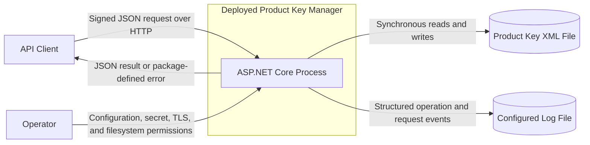
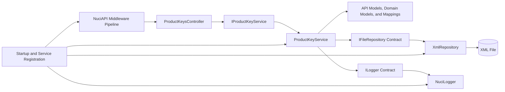
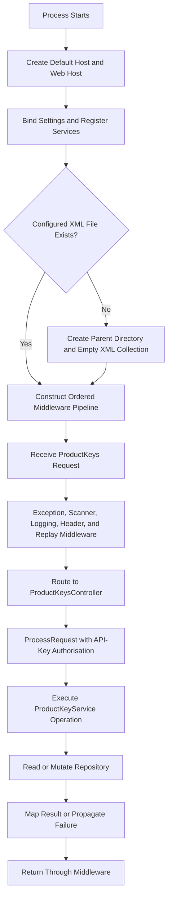
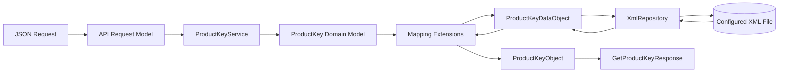
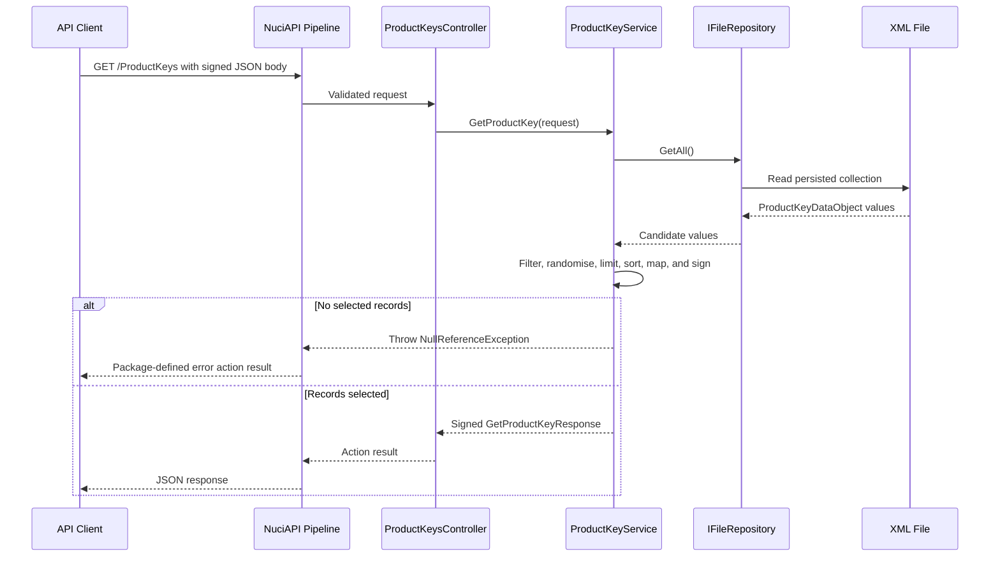
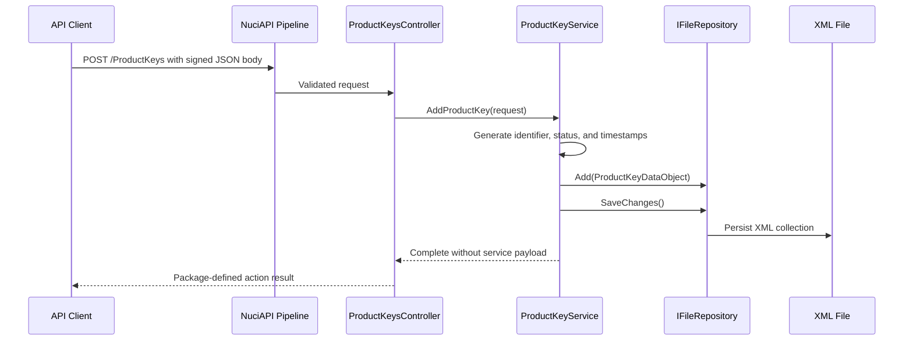
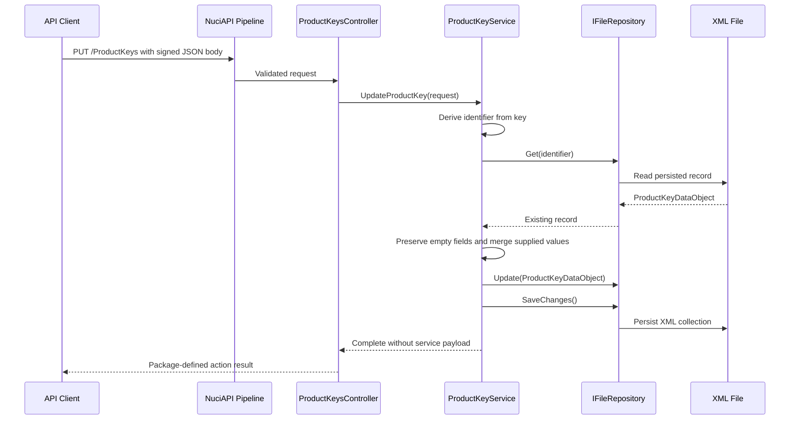
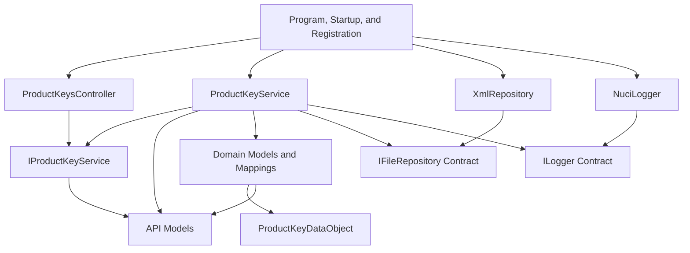

# Product Key Manager Architecture

This document describes the verified current architecture of the Product Key Manager HTTP service, its local persistence and delivery boundaries, and the accompanying test project. It does not define a target architecture or guarantees supplied only by external package internals.

## 📑 Table of Contents

- [Table of Contents](#-table-of-contents)
- [Purpose](#-purpose)
- [System Context](#-system-context)
- [Architectural Style](#-architectural-style)
- [Runtime Flow](#-runtime-flow)
- [Components](#-components)
- [Data Architecture](#-data-architecture)
- [Interfaces and Integrations](#-interfaces-and-integrations)
- [Key Flows](#-key-flows)
  - [Retrieve Product Keys](#retrieve-product-keys)
  - [Add a Product Key](#add-a-product-key)
  - [Update a Product Key](#update-a-product-key)
- [Cross-Cutting Concerns](#-cross-cutting-concerns)
  - [Security and Privacy](#security-and-privacy)
  - [Error Handling](#error-handling)
  - [Observability](#observability)
  - [Configuration](#configuration)
  - [Concurrency and Resource Use](#concurrency-and-resource-use)
- [Dependency Direction and Rules](#-dependency-direction-and-rules)
- [External Dependencies](#-external-dependencies)
- [Deployment and Operations](#-deployment-and-operations)
- [Compatibility Contracts](#-compatibility-contracts)
- [Testing and Verification](#-testing-and-verification)
- [Design Constraints](#-design-constraints)
- [Extension Points](#-extension-points)
  - [Product Key Service Implementation](#product-key-service-implementation)
  - [Persistence Repository](#persistence-repository)
- [Source Map](#-source-map)
- [Related Documentation](#-related-documentation)

## 🎯 Purpose

Product Key Manager provides signed HTTP operations for adding, filtering, retrieving, and updating product-key records. This document records the deployed service boundary, component responsibilities, persistence ownership, public contracts, dependency direction, and operational constraints evidenced by the repository. It is intended for contributors, maintainers, operators, and reviewers evaluating the impact of a change.

## 🌐 System Context

The deployed system is one ASP.NET Core process. API clients cross an untrusted network boundary to invoke the service. Operators own host configuration, secret injection, TLS termination, and writable filesystem locations. The process persists product-key state and application logs to configured local files; it contains no external database, queue, or remote runtime provider.



The principal external boundaries are:
- **API client:** Submits request bodies to the unversioned `/ProductKeys` route and receives action results. Signed-request processing is owned jointly by the controller and NuciAPI infrastructure.
- **Host operator:** Supplies the shared secret, datastore location, logger configuration, hosting addresses, TLS arrangement, and writable storage.
- **Local filesystem:** Retains the XML product-key collection and configured log file. Their durability, permissions, retention, and duplicate copies are external operational responsibilities.
- **Release infrastructure:** A maintainer may invoke [release.sh](release.sh), which retrieves and executes a remote deployment helper. This supply-chain boundary is not part of the running service.

## 🏗️ Architectural Style

The repository implements a single-process layered HTTP service with dependency injection and a repository adapter. ASP.NET Core and NuciAPI own hosting and request processing; the controller delegates domain operations through `IProductKeyService`; `ProductKeyService` orchestrates filtering, mapping, identifier generation, mutation, and persistence; NuciDAL supplies the selected XML repository. API models cross into the service contract, so the transport and service boundaries are coupled rather than isolated by separate application commands.



The principal architecture boundaries are:
- **Hosting and composition:** [ProductKeyManager/Program.cs](ProductKeyManager/Program.cs), [ProductKeyManager/Startup.cs](ProductKeyManager/Startup.cs), and [ProductKeyManager/ServiceCollectionExtensions.cs](ProductKeyManager/ServiceCollectionExtensions.cs) construct the host, middleware pipeline, configuration objects, and concrete singleton services.
- **HTTP API:** [ProductKeyManager/Api](ProductKeyManager/Api) owns route declarations, JSON property names, request validation annotations, HMAC ordering metadata, and response shapes.
- **Service and domain:** [ProductKeyManager/Service](ProductKeyManager/Service) owns product-key selection, mutation semantics, status values, identifiers, timestamps, and representation mappings.
- **Persistence representation:** [ProductKeyManager/DataAccess](ProductKeyManager/DataAccess) owns the XML-serialisable data object, while the external NuciDAL repository owns file I/O implementation details.
- **Cross-cutting infrastructure:** [ProductKeyManager/Configuration](ProductKeyManager/Configuration) and [ProductKeyManager/Logging](ProductKeyManager/Logging) define settings and structured logging vocabulary used by the composition and service boundaries.

## 🔄 Runtime Flow



The principal runtime sequence is:
1. [ProductKeyManager/Program.cs](ProductKeyManager/Program.cs) constructs the default .NET host and selects `Startup`.
2. `ConfigureServices` binds datastore and security settings, registers Nuci logger settings and security services, and registers the XML repository, product-key service, and logger as singletons.
3. `Configure` creates the configured datastore parent directory and an empty `ArrayOfProductKeyDataObject` XML document when the file is absent.
4. The host composes exception handling, scanner protection, request logging, optional developer diagnostics, HTTPS redirection, static-file handling, routing, header validation, replay protection, authorisation, and controller endpoints in source order.
5. ASP.NET Core routes `GET`, `POST`, or `PUT` on `/ProductKeys` to `ProductKeysController`.
6. The controller passes the request, service delegate, and API-key authorisation derived from `SecuritySettings.SharedSecretKey` to NuciAPI `ProcessRequest`.
7. `ProductKeyService` executes a synchronous retrieval or mutation and interacts with `IFileRepository<ProductKeyDataObject>`; mutations invoke `SaveChanges` immediately.
8. Successful retrievals are mapped and HMAC-signed; failures propagate to package-owned exception processing before an action result returns to the client.

## 🧩 Components

| Component | Responsibility | Principal Dependencies | Lifetime or Ownership |
|-----------|----------------|------------------------|-----------------------|
| Host and composition ([ProductKeyManager/Program.cs](ProductKeyManager/Program.cs), [ProductKeyManager/Startup.cs](ProductKeyManager/Startup.cs)) | Construct the web host, initialise the XML store, and define middleware order | ASP.NET Core, configuration, registration extensions | One host lifecycle |
| Registration extensions ([ProductKeyManager/ServiceCollectionExtensions.cs](ProductKeyManager/ServiceCollectionExtensions.cs)) | Bind settings and select concrete repository, service, and logger implementations | `IConfiguration`, ASP.NET Core DI, NuciDAL, NuciLog | Static composition utility |
| `ProductKeysController` ([ProductKeyManager/Api/Controllers/ProductKeysController.cs](ProductKeyManager/Api/Controllers/ProductKeysController.cs)) | Own `/ProductKeys` verbs and delegate signed request processing | `IProductKeyService`, `SecuritySettings`, `NuciApiController` | Framework-created controller instance per request |
| API contracts ([ProductKeyManager/Api/Models](ProductKeyManager/Api/Models)) | Define JSON names, HMAC field order, count validation, and retrieval response shape | NuciAPI requests and responses, NuciSecurity.HMAC | Request and response values owned by an operation |
| `ProductKeyService` ([ProductKeyManager/Service/ProductKeyService.cs](ProductKeyManager/Service/ProductKeyService.cs)) | Filter and select records, generate identifiers and timestamps, merge updates, map representations, sign retrieval responses, and coordinate persistence | API models, domain models, mapping extensions, repository, settings, logger | Explicit singleton |
| Domain and mapping ([ProductKeyManager/Service/Models](ProductKeyManager/Service/Models), [ProductKeyManager/Service/Mapping](ProductKeyManager/Service/Mapping)) | Represent product keys and statuses and transform API, domain, and persistence representations | API models and persistence data objects | Per-operation values plus static status instances and mapping functions |
| XML repository | Load and persist `ProductKeyDataObject` collections | NuciDAL `IFileRepository<T>` and `XmlRepository<T>`, configured path | Explicit singleton; implementation owned by NuciDAL |
| Structured logger ([ProductKeyManager/Logging](ProductKeyManager/Logging)) | Emit operation status and named contextual values | NuciLog `ILogger` and `NuciLogger` | Explicit singleton; destination configured externally |

## 💾 Data Architecture

Product-key state originates in JSON request models. The service creates or revises an in-memory `ProductKey`, mapping it to `ProductKeyDataObject` for NuciDAL persistence. Reads perform the inverse conversion before exposing `ProductKeyObject` values. The XML file is the sole persistent product-key store evidenced by the repository; there is no schema migration, cache, deletion operation, or archival process.

Identifiers are generated as the string representation of a `Guid` constructed from the MD5 digest of `Encoding.Default.GetBytes(key)`. This is a deterministic locator rather than an authentication mechanism. Added and updated timestamps use local `DateTime.Now` and persist as strings with the exact `yyyy.MM.ddTHH:mm:ss.ffffzzz` format; reads parse that format with invariant culture. Status strings map to one of seven static `ProductKeyStatus` values, with absent or unrecognised values becoming `Unknown`.



| Data or Store | Owner | Representation and Storage | Lifecycle or Consistency |
|---------------|-------|----------------------------|--------------------------|
| API request and response models | API boundary | JSON properties declared in [ProductKeyManager/Api/Models](ProductKeyManager/Api/Models) | Created per request; wire names and HMAC metadata are compatibility-sensitive |
| `ProductKey` and `ProductKeyStatus` | Service boundary | In-memory C# objects in [ProductKeyManager/Service/Models](ProductKeyManager/Service/Models) | Product keys are operation-local; the seven status instances are static process state |
| `ProductKeyDataObject` collection | Service and repository boundary | XML-serialisable object extending NuciDAL `EntityBase`; persisted at `DataStoreSettings.ProductKeysStorePath` | Added or revised synchronously, followed by `SaveChanges`; repository atomicity and locking are not defined locally |
| Product-key XML file | Host operator and NuciDAL repository | One configured filesystem file initialised with an empty collection root | Retained until externally modified or deleted; startup recreates only an absent file and performs no migration |
| Structured log data | NuciLog and host operator | Named operation fields written to the configured log destination | Retention, rotation, access control, and redaction are not defined in this repository |

## 🔌 Interfaces and Integrations

| Interface or Integration | Direction | Contract | Owner | Failure Semantics |
|--------------------------|-----------|----------|-------|-------------------|
| `GET /ProductKeys` | Inbound | JSON body with optional `store`, `product`, `key`, `owner`, and `status` regex filters plus `count` from 1 to 1000 | `ProductKeysController`, `GetProductKeyRequest`, and `ProductKeyService` | No selected record raises `NullReferenceException`; invalid regex, repository, mapping, and signing failures propagate to NuciAPI exception handling; exact HTTP translation is external |
| `POST /ProductKeys` | Inbound | JSON body with `store`, `product`, `key`, `owner`, `comment`, and `status`; the local service operation returns no payload | `ProductKeysController`, `AddProductKeyRequest`, and `ProductKeyService` | No local duplicate pre-check, retry, or failure translation; repository and mapping failures propagate through NuciAPI |
| `PUT /ProductKeys` | Inbound | JSON body with the same fields as add; `key` locates the record and non-empty fields revise it | `ProductKeysController`, `UpdateProductKeyRequest`, and `ProductKeyService` | Missing records, invalid keys, parse failures, and repository failures propagate through NuciAPI; exact action result is package-owned |
| Product-key XML file | Outbound local persistence | NuciDAL `IFileRepository<ProductKeyDataObject>` using `XmlRepository<ProductKeyDataObject>` | Composition root and NuciDAL | Synchronous errors propagate; no local retry, fallback, transaction, or corruption recovery exists |
| Structured logging | Outbound local diagnostics | NuciLog `ILogger`, operation names, contextual fields, and request-logging middleware | `ProductKeyService`, NuciAPI middleware, and NuciLogger | Logger failure and request redaction semantics are owned by external packages |
| Remote release helper | Outbound delivery-time integration | [release.sh](release.sh) retrieves the .NET 10 deployment script from the maintainer's `deployment-scripts` repository and pipes it to Bash | Release wrapper and remote repository | No local integrity verification, vendored duplicate, or fallback is present |

## 🔀 Key Flows

### Retrieve Product Keys



Every non-empty filter is passed to `Regex.IsMatch`. When a pattern starts without `^` and concludes without `$`, the service supplies both anchors; a pattern containing either boundary marker remains unchanged. Empty filters accept every value, null record values fail non-empty filters, and `count` limits only the result set. The service scans all repository records, applies `Distinct`, randomises candidates, selects up to `count`, then orders the selected records by product name and key. The API representation omits identifier, confirmation code, and timestamps. The response signs the product collection with the shared secret, while computed `count` is marked `HmacIgnore`.

### Add a Product Key



The key determines the identifier. `AddedDateTime` and `UpdatedDateTime` receive the same local timestamp, and unrecognised status text becomes `Unknown`. The service contains no duplicate query or explicit conflict translation before calling the repository.

### Update a Product Key



`key` is the immutable locator and is not revised during the merge. Non-empty store, product, owner, and comment values replace persisted values; empty values preserve them. `Unknown`, including absent or unrecognised status text, preserves the persisted status. The service assigns a recent local `UpdatedDateTime`, then performs `Update` and `SaveChanges` as separate repository calls.

## 🧵 Cross-Cutting Concerns

### Security and Privacy

`ProductKeysController` derives NuciAPI API-key authorisation from the singleton shared secret and submits it to `ProcessRequest`. Request models and product-key response objects define HMAC field order through attributes; retrieval responses invoke `SignHMAC`. Scanner protection, header validation, and replay protection middleware are registered, but their algorithms, headers, replay state, and rejection responses reside in external packages and are not verified by local tests. HTTPS redirection is configured; certificate provisioning and any proxy termination remain host responsibilities. No separate user identity, role, or policy model is present.

The checked-in shared-secret setting is a deployment token rather than a usable secret and must be supplied through an operator-controlled configuration provider. Product keys, owner identifiers, comments, and signatures are sensitive. `ProductKeyService` includes keys, owners, and comments in structured logging context, and request-logging middleware may observe request bodies. No local redaction or retention policy is visible, so log access and external package configuration require corresponding protection.

### Error Handling

NuciAPI exception handling is the outermost registered middleware. The service explicitly raises `NullReferenceException` when retrieval selects no records; malformed regular expressions, null keys, strict timestamp parse failures, missing repository records, file I/O errors, and signing errors are not locally translated. There are no retries, compensating actions, or degraded read paths. Exact status codes and response schemas for these exceptions are external package contracts and lack integration verification in this repository.

### Observability

The service emits started, success, and selected failure events through NuciLog using the operation names `GetProductKey`, `AddProductKey`, and `UpdateProductKey`. Context can contain store, product, key, owner, status, count, and comment values. NuciAPI request-logging middleware is also active, and the checked-in logger configuration activates file emission. No health endpoint, metric, distributed trace, audit store, or documented correlation contract is present.

### Configuration

The host uses `Host.CreateDefaultBuilder`, then binds settings once into singleton objects during composition.

| Configuration Area | Source | Responsibility | Override or Secret Policy |
|--------------------|--------|----------------|---------------------------|
| `DataStoreSettings` | `dataStoreSettings` section in [ProductKeyManager/appsettings.json](ProductKeyManager/appsettings.json) and default host providers | Select the product-key XML path | Deployment may override the checked-in relative path; the process requires parent-directory write access |
| `SecuritySettings` | `securitySettings` section in [ProductKeyManager/appsettings.json](ProductKeyManager/appsettings.json) and default host providers | Supply API-key authorisation and HMAC signing secret | The checked-in token is not a secret; inject a protected deployment value and restrict its disclosure |
| Nuci logger settings | `nuciLoggerSettings` section in [ProductKeyManager/appsettings.json](ProductKeyManager/appsettings.json) via `AddNuciLoggerSettings` | Select minimum level, file path, and file emission | Deployment overrides and destination protection are operator-owned |
| ASP.NET Core host | Default host configuration providers | Select environment, addresses, server, and framework diagnostics | Provider precedence is supplied by the .NET host; production TLS and environment values are external |

### Concurrency and Resource Use

ASP.NET Core may dispatch requests concurrently, while the product-key service, repository, logger, and settings are singleton instances. All service and repository calls exposed here are synchronous. The application source contains no lock, queue, transaction coordinator, cancellation path, concurrency token, or cross-process coordination; any guarantees inside `XmlRepository` are not evidenced locally. Consequently, concurrent or multi-instance mutation safety requires verification before such deployment.

Retrieval loads and filters the complete repository collection in memory and executes client-supplied regular expressions for each applicable field. The `count` range limits returned records to 1 through 1000 but does not constrain scanning cost, XML size, regex complexity, or request frequency. No pagination, timeout, backpressure, or resource quota is implemented locally.

## 🧭 Dependency Direction and Rules

Dependencies proceed from host composition into HTTP transport, then from the controller into the service contract and from the service implementation into models, mappings, repository abstractions, settings, and logging abstractions. Concrete infrastructure is selected only at registration. The principal exception to conventional layer isolation is that both `IProductKeyService` and `ProductKeyService` directly consume API request and response models.



The principal dependency rules are:
- Host composition owns concrete implementation selection and singleton lifetimes; controllers and services do not instantiate those collaborators.
- The controller invokes product-key operations through `IProductKeyService` and does not access persistence directly.
- `ProductKeyService` accesses persisted state through `IFileRepository<ProductKeyDataObject>` and commits each mutation with `SaveChanges`.
- Mapping extensions own API, domain, and persistence representation conversion; persisted timestamp and status parsing must remain centralised there.
- API contract changes can require service changes because service interfaces directly expose API models; this coupling must be evaluated as a public compatibility impact.
- Data-access, configuration, and logging model types must not acquire dependencies upon controllers; concrete adapters remain selected at the composition boundary.
- Any singleton substitute must support the host's concurrent request lifetime or introduce an explicit narrower lifetime and corresponding verification.

## 📦 External Dependencies

| Dependency | Responsibility | Integration Boundary | Architectural Consequence |
|------------|----------------|----------------------|---------------------------|
| .NET 10 and ASP.NET Core | Host process, dependency injection, configuration, routing, model validation, middleware, and HTTP server | `Program`, `Startup`, controller, and project manifest | The deployable requires a .NET 10-compatible runtime; framework defaults influence hosting and concurrency |
| NuciAPI package family | Base request/response and controller types, request processing, exception handling, request logging, scanner protection, and replay protection | Controller inheritance and middleware pipeline | Wire-level authorisation and failure details are package contracts not defined or integration-tested locally |
| NuciSecurity.HMAC | HMAC metadata and response signing extensions | API models and retrieval service | Attribute order and ignored fields form a compatibility-sensitive signature contract |
| NuciDAL | Generic file repository contract, entity base, and XML repository implementation | Registration, service, and persistence data object | XML serialisation, locking, atomicity, and corruption semantics are delegated to the package |
| NuciLog and NuciLog.Core | Logger implementation, abstractions, operation statuses, and structured information keys | Registration, middleware, service, and logging vocabulary | Diagnostic availability and file I/O semantics depend upon package configuration |
| NuciExtensions | Collection emptiness checks and candidate randomisation | Retrieval service | Selected records depend upon package `Shuffle` semantics |
| NUnit, NSubstitute, and .NET test SDK | Unit-test execution and collaborator substitution | [ProductKeyManager.UnitTests](ProductKeyManager.UnitTests) | Current verification is isolated from real HTTP, middleware, and filesystem infrastructure |
| Remote deployment helper | Versioned release procedure downloaded at invocation time | [release.sh](release.sh) | Release execution depends upon network availability and mutable remote content |

## 🚀 Deployment and Operations

The deployment unit is the output of the ASP.NET Core project targeting .NET 10. One process hosts all middleware, controller, service, repository, and logger instances. [ProductKeyManager/appsettings.json](ProductKeyManager/appsettings.json) is copied to the output directory, but deployment-specific secrets and paths remain operator inputs. Relative datastore and log paths resolve from the process working directory, and durable writable storage is necessary to retain state across replacement or restart.

At startup, the service creates the datastore parent directory and an empty XML collection when absent. Failure to create or access the configured path prevents normal operation; no retry or readiness gate is defined. Each mutation calls `SaveChanges` before returning. The host uses framework shutdown conduct and contains no custom disposal, drainage, duplicate creation, or restoration procedure.

| Concern | Current Design | Architectural Consequence |
|---------|----------------|---------------------------|
| Process topology | One ASP.NET Core process with singleton application collaborators | In-process state and repository access are shared among concurrent requests |
| Persistent state | One configured XML file plus a configured log file | Containers and service managers require mounted durable storage and explicit permissions |
| Startup | Create missing datastore directory and empty XML root synchronously | Invalid paths, permission failures, or malformed existing XML have no local recovery path |
| Scaling | No local cross-process coordination or datastore concurrency contract | Multi-instance writes and elevated mutation concurrency are unsupported until verified or redesigned |
| Availability | No health checks, readiness checks, replication, failover, or duplicate store | Operators receive only host and logger diagnostics; recovery is external |
| Continuous integration | [.github/workflows/dotnet.yml](.github/workflows/dotnet.yml) restores, compiles, and tests on Ubuntu for `master` pushes and pull requests | CI verifies source and unit tests but performs no deployment |
| Release | [release.sh](release.sh) downloads and executes an external .NET 10 release helper | Maintainers must review and rely upon remote release content and network availability |

## 🛡️ Compatibility Contracts

| Contract | Owner | Invariant | Verification | Change Policy |
|----------|-------|-----------|--------------|---------------|
| `/ProductKeys` HTTP surface | `ProductKeysController` | Unversioned route with body-bearing `GET`, plus `POST` and `PUT`; JSON property names are explicit | Compilation and manual or future integration tests; no current controller tests | Coordinate any route, verb, body, or response change with all clients |
| Request HMAC ordering | API request models | Get order is store, product, key, owner, status, count; add and update order is store, product, key, owner, comment, status | Attribute inspection; no current end-to-end signing tests | Preserve ordinal meaning or perform a coordinated client and service migration |
| Retrieval response signature | `ProductKeyService`, `ProductKeyObject`, and `GetProductKeyResponse` | Product fields use ordinals 1 through 6; computed `count` is excluded through `HmacIgnore` | Response model tests cover values and count, not signature bytes | Treat field order, inclusion, and signing changes as wire-contract changes |
| Deterministic product-key identifier | `ProductKeyService` | `Guid(MD5(Encoding.Default(key))).ToString()` locates updates | Service unit tests calculate and verify the identifier | Changing hash, encoding, or GUID conversion requires persisted identifier migration |
| XML representation | Mapping extensions, `ProductKeyDataObject`, and NuciDAL | Empty root name, property names, status strings, and exact timestamp format remain readable | Service tests exercise mapped data objects; no real XML round-trip test | Add migration and compatibility verification before changing persisted shape or format |
| Product-key statuses | `ProductKeyStatus` | `Unknown`, `Used`, `Vacant`, `Invalid`, `AlreadyOwned`, `RequiresBaseProduct`, and `RegionLocked`; unrecognised text maps to `Unknown` | `ProductKeyStatusTests` | Additions or semantic changes require API, persistence, signature, and client evaluation |
| Update merge semantics | `ProductKeyService` | Key is the locator; empty text and `Unknown` status preserve persisted values; fields cannot be explicitly cleared | Service unit tests cover preservation and replacement | Maintain semantics or introduce an explicit, coordinated clear/update contract |
| Retrieval selection semantics | `ProductKeyService` | Regex filters, full scan, random candidate selection, count limit, then product/key ordering | Service unit tests cover filters and result counts, not statistical randomisation | Treat filter anchoring and selection-order changes as externally observable |

## ✅ Testing and Verification

[ProductKeyManager.UnitTests](ProductKeyManager.UnitTests) references the production project and uses NUnit with NSubstitute. `ProductKeyServiceTests` verify retrieval filters and counts, no-result failure, deterministic identifiers, add persistence calls, update lookup and merge semantics, and timestamp assignment through a substituted repository. `ProductKeyStatusTests` verify the seven values, name conversion, equality, and operators. `GetProductKeyResponseTests` verify constructors, property preservation, and computed counts.

No current test constructs the ASP.NET Core host, invokes controller routes, validates request or response HMAC bytes, exercises middleware rejection and exception translation, serialises a real XML file, verifies file corruption handling, simulates concurrent requests, or invokes release infrastructure. Those boundaries require integration or operational verification when revised.

Execute the principal automated verification with:
```bash
dotnet test ProductKeyManager.slnx
```

The CI equivalent in [.github/workflows/dotnet.yml](.github/workflows/dotnet.yml) performs `dotnet restore`, `dotnet build --no-restore`, and `dotnet test --no-build --verbosity normal` on Ubuntu.

## ⚠️ Design Constraints

- **File-based persistence:** All product-key state occupies one XML file. Datastore atomicity, concurrent writer safety, file size limits, and corruption recovery are not defined by local code.
- **Singleton synchronous operations:** The service and repository are shared across concurrent requests, and every repository interaction blocks the request path.
- **Full-collection retrieval:** Each get operation loads and filters all records before limiting results; client regex complexity and collection size directly influence latency and memory.
- **Transport coupling:** API request and response models are embedded in the service interface, so wire-contract revisions propagate into the service boundary.
- **Unversioned, body-bearing GET:** The sole route has no version segment, and retrieval depends upon a GET request body, which some intermediaries and clients may process inconsistently.
- **Partial update limitations:** Empty values mean preserve, the key cannot change, and no explicit field-clear or delete operation exists.
- **Compatibility-sensitive identifiers:** MD5-derived GUID strings are deterministic but do not constitute a collision-proof uniqueness constraint; the repository's duplicate-ID conduct is external.
- **Strict persisted timestamps:** Existing XML must contain the exact custom timestamp form or mapping fails; there is no schema version or migration facility.
- **Sensitive diagnostics:** Product keys and owner data enter structured logging context, while local redaction, retention, and audit policies are absent.
- **Opaque package boundaries:** Authorisation details, exception-to-HTTP translation, replay state, repository locking, XML atomicity, and logger failure conduct reside outside this repository.
- **Remote release execution:** The release wrapper executes downloaded source without a locally pinned digest or vendored duplicate.

## 🔧 Extension Points

### Product Key Service Implementation

1. Implement `IProductKeyService` with the existing API model contract or revise the controller and contract together.
2. Register the implementation in `AddCustomServices` at [ProductKeyManager/ServiceCollectionExtensions.cs](ProductKeyManager/ServiceCollectionExtensions.cs).
3. Add service tests and, for altered wire semantics, controller and HMAC integration tests.

The current registration is singleton. A substitute must support concurrent invocation for that lifetime or deliberately revise the lifetime and resource ownership model.

### Persistence Repository

1. Supply an `IFileRepository<ProductKeyDataObject>` implementation compatible with the service's `GetAll`, `Get`, `Add`, `Update`, and `SaveChanges` sequence.
2. Revise registration in [ProductKeyManager/ServiceCollectionExtensions.cs](ProductKeyManager/ServiceCollectionExtensions.cs) and eliminate or generalise XML-specific initialisation in [ProductKeyManager/Startup.cs](ProductKeyManager/Startup.cs) when appropriate.
3. Add persistence round-trip, failure, and concurrency verification for the selected backend.

The service expects synchronous calls and immediate persistence after every mutation. A repository with different consistency, transaction, lifetime, or asynchronous semantics requires a coordinated service-contract revision.

## 🗺️ Source Map

| Area | Path |
|------|------|
| Solution composition | [ProductKeyManager.slnx](ProductKeyManager.slnx) |
| Production project and dependency manifest | [ProductKeyManager/ProductKeyManager.csproj](ProductKeyManager/ProductKeyManager.csproj) |
| Host entry point and middleware composition | [ProductKeyManager/Program.cs](ProductKeyManager/Program.cs), [ProductKeyManager/Startup.cs](ProductKeyManager/Startup.cs), [ProductKeyManager/ServiceCollectionExtensions.cs](ProductKeyManager/ServiceCollectionExtensions.cs) |
| HTTP controllers and wire models | [ProductKeyManager/Api](ProductKeyManager/Api) |
| Configuration contracts | [ProductKeyManager/Configuration](ProductKeyManager/Configuration) |
| Persistence representation | [ProductKeyManager/DataAccess](ProductKeyManager/DataAccess) |
| Service, domain, and mappings | [ProductKeyManager/Service](ProductKeyManager/Service) |
| Structured logging vocabulary | [ProductKeyManager/Logging](ProductKeyManager/Logging) |
| Unit-test project | [ProductKeyManager.UnitTests](ProductKeyManager.UnitTests) |
| Continuous integration | [.github/workflows/dotnet.yml](.github/workflows/dotnet.yml) |
| Release wrapper | [release.sh](release.sh) |

## 📚 Related Documentation

- [README.md](README.md) provides project purpose, development prerequisites, build and execution commands, dependency summaries, contribution guidance, and release usage.
- [LICENSE](LICENSE) defines the repository's GNU General Public License terms.