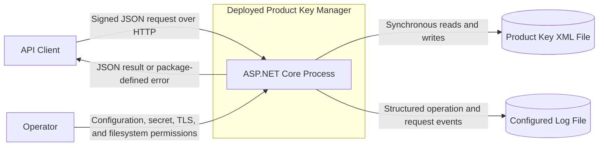
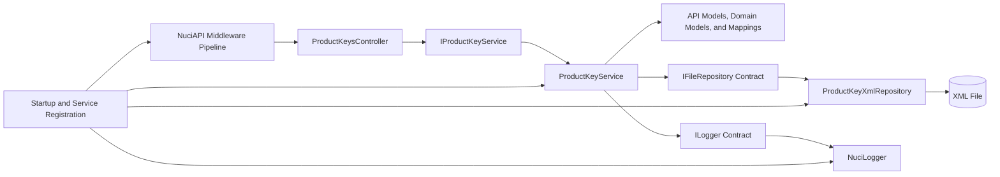
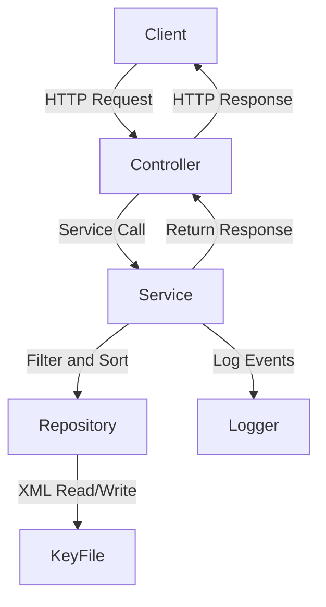

# Product Key Manager Architecture

This document describes the verified current architecture of the Product Key Manager HTTP service, its local persistence and delivery boundaries, and the accompanying test project. It does not define a target architecture or guarantees supplied only by external package internals.

## 📑 Table of Contents

- [Purpose](#-purpose)
- [System Context](#-system-context)
- [Architectural Style](#-architectural-style)
- [Runtime Flow](#-runtime-flow)
- [Components](#-components)
- [Data Architecture](#-data-architecture)
- [Interfaces and Integrations](#-interfaces-and-integrations)
- [Key Flows](#-key-flows)
  - [Retrieve Product Keys](#retrieve-product-keys)
  - [Add a Product Key](#add-a-product-key)
  - [Update a Product Key](#update-a-product-key)
- [Cross-Cutting Concerns](#-cross-cutting-concerns)
  - [Security and Privacy](#security-and-privacy)
  - [Error Handling](#error-handling)
  - [Observability](#observability)
  - [Configuration](#configuration)
  - [Concurrency and Resource Use](#concurrency-and-resource-use)
- [Dependency Direction and Rules](#-dependency-direction-and-rules)
- [External Dependencies](#-external-dependencies)
- [Deployment and Operations](#-deployment-and-operations)
- [Compatibility Contracts](#-compatibility-contracts)
- [Testing and Verification](#-testing-and-verification)
- [Design Constraints](#-design-constraints)
- [Extension Points](#-extension-points)
  - [Product Key Service Implementation](#product-key-service-implementation)
  - [Persistence Repository](#persistence-repository)
- [Source Map](#-source-map)
- [Related Documentation](#-related-documentation)

## 🎯 Purpose

Product Key Manager provides signed HTTP operations for adding, filtering, retrieving, and updating product-key records. This document records the deployed service boundary, component responsibilities, persistence ownership, public contracts, dependency direction, and operational constraints evidenced by the repository. It is intended for contributors, maintainers, operators, and reviewers evaluating the impact of a change.

## 🌐 System Context

The deployed system is one ASP.NET Core process. API clients cross an untrusted network boundary to invoke the service. Operators own host configuration, secret injection, TLS termination, and writable filesystem locations. The process persists product-key state and application logs to configured local files; it contains no external database, queue, or remote runtime provider.

The principal external boundaries are:
- **API client:** Submits request bodies to the unversioned `/ProductKeys` route and receives action results. Signed-request processing is owned jointly by the controller and NuciAPI infrastructure.
- **Host operator:** Supplies the shared secret, datastore location, logger configuration, hosting addresses, TLS arrangement, and writable storage.
- **Local filesystem:** Retains the XML product-key collection and configured log file. Their durability, permissions, retention, and duplicate copies are external operational responsibilities.
- **Release infrastructure:** A maintainer may invoke [release.sh](release.sh), which retrieves and executes a remote deployment helper. This supply-chain boundary is not part of the running service.

## 🏗️ Architectural Style

The repository implements a single-process layered HTTP service with dependency injection and a repository adapter. ASP.NET Core and NuciAPI own hosting and request processing; the controller delegates domain operations through `IProductKeyService`; `ProductKeyService` orchestrates filtering, mapping, identifier generation, mutation, and persistence; NuciDAL supplies the selected XML repository. API models cross into the service contract, so the transport and service boundaries are coupled rather than isolated by separate application commands.

The principal architecture boundaries are:
- **Hosting and composition:** [ProductKeyManager/Program.cs](ProductKeyManager/Program.cs), [ProductKeyManager/Startup.cs](ProductKeyManager/Startup.cs), and [ProductKeyManager/ServiceCollectionExtensions.cs](ProductKeyManager/ServiceCollectionExtensions.cs) construct the host, middleware pipeline, configuration objects, and concrete singleton services.
- **HTTP API:** [ProductKeyManager/Api](ProductKeyManager/Api) owns route declarations, JSON property names, request validation annotations, HMAC ordering metadata, and response shapes.
- **Service and domain:** [ProductKeyManager/Service](ProductKeyManager/Service) owns product-key selection, mutation semantics, status values, identifiers, timestamps, and representation mappings.
- **Persistence representation:** [ProductKeyManager/DataAccess](ProductKeyManager/DataAccess) owns the XML-serialisable data object, while the external NuciDAL repository owns file I/O implementation details.
- **Cross-cutting infrastructure:** [ProductKeyManager/Configuration](ProductKeyManager/Configuration) and [ProductKeyManager/Logging](ProductKeyManager/Logging) define settings and structured logging vocabulary used by the composition and service boundaries.

## 🔄 Runtime Flow

## 🏗️ Components

### Core Application Components

| Component | Location | Responsibility |
|-----------|----------|----------------|
| `ProductKeyManager/Program.cs` | ProductKeyManager/ | Host startup and runtime entry point |
| `ProductKeyManager/Startup.cs` | ProductKeyManager/ | Configure services and middleware pipeline |
| `ProductKeyManager/ServiceCollectionExtensions.cs` | ProductKeyManager/ | Dependency injection registration and configuration |
| `ProductKeyManager/Api/Controllers/ProductKeysController.cs` | ProductKeyManager/Api/Controllers/ | HTTP endpoint definitions and request processing |
| `ProductKeyManager/Service/ProductKeyService.cs` | ProductKeyManager/Service/ | Business logic for product-key operations |
| `ProductKeyManager/Service/IProductKeyService.cs` | ProductKeyManager/Service/ | Service contract for product-key operations |
| `ProductKeyManager/DataAccess/ProductKeyXmlRepository.cs` | ProductKeyManager/DataAccess/ | XML persistence implementation |
| `ProductKeyManager/Configuration/DataStoreSettings.cs` | ProductKeyManager/Configuration/ | Data store configuration |
| `ProductKeyManager/Configuration/SecuritySettings.cs` | ProductKeyManager/Configuration/ | Security configuration |
| `ProductKeyManager/Logging/MyLogInfoKey.cs` | ProductKeyManager/Logging/ | Structured logging keys |
| `ProductKeyManager/Logging/MyOperation.cs` | ProductKeyManager/Logging/ | Structured logging operations |

### Model Components

| Component | Location | Responsibility |
|-----------|----------|----------------|
| `ProductKeyManager/Api/Models/` | ProductKeyManager/Api/Models/ | API request/response models |
| `ProductKeyManager/Service/Models/` | ProductKeyManager/Service/Models/ | Domain models and business entities |
| `ProductKeyManager/Service/Mapping/` | ProductKeyManager/Service/Mapping/ | Model transformation utilities |
| `ProductKeyManager/DataAccess/DataObjects/` | ProductKeyManager/DataAccess/DataObjects/ | Persistence data objects |

### Test Components

| Component | Location | Responsibility |
|-----------|----------|----------------|
| `ProductKeyManager.UnitTests/` | ProductKeyManager.UnitTests/ | Unit tests for service and models |
| `ProductKeyManager.IntegrationTests/` | ProductKeyManager.IntegrationTests/ | Integration tests for HTTP API |

## 📊 Data Architecture

### Data Flow

1. **Product Key Records**
   - Stored in XML file at `Data/keys.xml` (default)
   - Schema: `ProductKeyDataObject` with fields: Id, StoreName, ProductName, Key, Owner, ConfirmationCode, Comment, Status, AddedDateTime, UpdatedDateTime
   - Format: ISO 8601 timestamps with `yyyy.MM.ddTHH:mm:ss.ffffzzz` format

2. **Request Logs**
   - Stored in file configured by `nuciLoggerSettings.logFilePath` (default: `logfile.log`)
   - Format: Structured JSON logs with request metadata
   - No request bodies or sensitive fields logged

3. **Configuration**
   - `appsettings.json` contains:
     - `securitySettings.sharedSecretKey`: HMAC shared secret
     - `dataStoreSettings.productKeysStorePath`: XML file path
     - `nuciLoggerSettings`: logging configuration

### Data Ownership

- **Product Key Manager Project:** Owns the application logic and API contracts
- **Instance Operator:** Owns the actual file system locations, backups, and retention policies
- **Local Filesystem:** Physical storage for both XML data and log files

## 🔌 Interfaces and Integrations

### Internal Interfaces

| Interface | Location | Purpose |
|-----------|----------|---------|
| `IProductKeyService` | ProductKeyManager/Service/ | Service contract for product-key operations |
| `IFileRepository<ProductKeyDataObject>` | NuciDAL.Repositories | Generic repository interface for XML persistence |
| `ILogger` | NuciLog.Core | Structured logging interface |

### External Integrations

| Integration | Purpose | Responsibility |
|-------------|---------|----------------|
| NuciAPI | HTTP middleware, request validation, HMAC signing | Framework provider |
| NuciDAL | XML repository implementation | Framework provider |
| NuciLog | Structured logging implementation | Framework provider |
| NuciExtensions | Collection utilities | Framework provider |
| NuciSecurity.HMAC | HMAC signing and verification | Framework provider |

## 🔑 Key Flows

### Retrieve Product Keys

1. **Client Request:** HTTP GET to `/ProductKeys` with optional query parameters
2. **Controller Processing:** Validates HMAC signature, parses request
3. **Service Execution:** Calls `ProductKeyService.GetProductKey()`
4. **Repository Access:** Reads XML file via `ProductKeyXmlRepository`
5. **Data Transformation:** Maps `ProductKeyDataObject` to domain models
6. **Response Generation:** Signs HMAC response, returns JSON
7. **Logging:** Records operation with structured metadata

### Add a Product Key

1. **Client Request:** HTTP POST to `/ProductKeys` with product-key data
2. **Controller Processing:** Validates HMAC signature, parses request
3. **Service Execution:** Calls `ProductKeyService.AddProductKey()`
4. **Domain Model Creation:** Creates `ProductKey` with timestamps and confirmation code
5. **Persistence:** Maps to `ProductKeyDataObject` and saves via repository
6. **Response:** Returns success with generated confirmation code
7. **Logging:** Records operation with structured metadata

### Update a Product Key

1. **Client Request:** HTTP PUT to `/ProductKeys` with updated product-key data
2. **Controller Processing:** Validates HMAC signature, parses request
3. **Service Execution:** Calls `ProductKeyService.UpdateProductKey()`
4. **Domain Model Creation:** Creates `ProductKey` with updated timestamps
5. **Persistence:** Updates existing `ProductKeyDataObject` in repository
6. **Response:** Returns success confirmation
7. **Logging:** Records operation with structured metadata

## ⚠️ Cross-Cutting Concerns

### Security and Privacy

- **HMAC Authentication:** All API requests must be signed with a shared secret
- **Replay Protection:** NuciAPI middleware prevents replay attacks
- **Input Validation:** Request models use data annotations for validation
- **Error Handling:** NuciAPI middleware provides consistent error responses
- **Logging Security:** No sensitive data (passwords, tokens, request bodies) logged

### Error Handling

- **Global Exception Handling:** NuciAPI middleware catches and formats exceptions
- **Validation Errors:** Data annotation validation returns detailed error messages
- **Business Logic Errors:** Service layer throws `NullReferenceException` for missing keys
- **Security Errors:** HMAC validation failures return 401/403 responses

### Observability

- **Structured Logging:** NuciLogger with custom keys and operations
- **Log Levels:** Configurable minimum level (default: Info)
- **Log Output:** File-based logging with configurable path
- **Log Content:** Request metadata, operation status, structured context

### Configuration

- **Settings Binding:** Configuration binds to strongly-typed settings classes
- **Environment Variables:** Supports ASP.NET Core configuration sources
- **File-based:** Primary configuration via `appsettings.json`
- **Hot Reload:** Configuration changes require service restart

### Concurrency and Resource Use

- **Singleton Services:** All services are registered as singletons
- **File I/O:** Synchronous reads/writes to XML file
- **Memory Usage:** In-memory filtering of up to 1000 records
- **CPU Usage:** Minimal, dominated by XML parsing and HMAC operations

## 📐 Dependency Direction and Rules

### Dependency Rules

1. **Presentation → Service:** Controllers depend on service interfaces
2. **Service → Repository:** Service depends on repository interfaces
3. **Service → Models:** Service depends on domain models and mappings
4. **Composition → All:** Composition root depends on all concrete implementations
5. **Tests → Implementation:** Tests depend on concrete implementations for mocking

### Dependency Inversion

- High-level modules (controllers, service) depend on abstractions (interfaces)
- Low-level modules (repository implementations, logging) provide abstractions
- Dependencies flow toward abstractions, not concretions

## 📦 External Dependencies

### Framework Dependencies

| Package | Version | Purpose |
|---------|---------|---------|
| NuciAPI | 3.6.1 | HTTP middleware and request processing |
| NuciAPI.Controllers | 2.3.1 | Controller infrastructure |
| NuciAPI.Middleware | 2.0.3 | Middleware pipeline |
| NuciAPI.Middleware.ExceptionHandling | 1.0.2 | Global exception handling |
| NuciAPI.Middleware.Logging | 1.0.1 | Request logging |
| NuciAPI.Middleware.Security | 1.0.6 | Scanner and replay protection |
| NuciDAL | 3.2.1 | XML data access layer |
| NuciExtensions | 5.3.2 | Collection utilities |
| NuciLog | 1.2.1 | Logging implementation |
| NuciLog.Core | 3.1.0 | Logging interfaces |
| NuciSecurity.HMAC | 4.1.3 | HMAC signing and verification |

### Runtime Dependencies

- **.NET 10.0:** Target framework for the application
- **ASP.NET Core:** Web hosting and middleware pipeline
- **XML Serialization:** For persistence layer

## 🚀 Deployment and Operations

### Deployment Steps

1. **Prerequisites:** .NET 10.0 SDK installed
2. **Configuration:** Set `securitySettings.sharedSecretKey` in `appsettings.json`
3. **Build:** `dotnet build ProductKeyManager.slnx`
4. **Run:** `dotnet run --project ProductKeyManager`
5. **Monitoring:** Check `logfile.log` for operational events
6. **Maintenance:** Restart service after configuration changes

### Operational Responsibilities

- **Instance Operator:** Manages host configuration, TLS, secrets, and file system permissions
- **Project Maintainer:** Manages source code, releases, and dependency updates
- **API Clients:** Provide valid HMAC signatures in requests

## 🔄 Compatibility Contracts

### API Contract

- **Endpoint:** `/ProductKeys` (unversioned)
- **Methods:** GET, POST, PUT
- **Authentication:** HMAC signature in request headers
- **Request Format:** JSON with specific property names
- **Response Format:** JSON with HMAC signature

### Data Contract

- **Product Key Status Values:** Unknown, Used, Vacant, Invalid, AlreadyOwned, RequiresBaseProduct, RegionLocked
- **Timestamp Format:** `yyyy.MM.ddTHH:mm:ss.ffffzzz` (ISO 8601 with custom format)
- **XML Structure:** Defined by `ProductKeyDataObject` schema

## 🧪 Testing and Verification

### Test Strategy

- **Unit Tests:** Test service logic, model transformations, and business rules
- **Integration Tests:** Test HTTP API, authentication, and persistence
- **End-to-End Tests:** Test complete workflows across service boundaries

### Test Coverage

- **ProductKeyServiceTests:** Service method behavior, filtering, and error handling
- **ProductKeysApiIntegrationTests:** HTTP endpoints, authentication, and CRUD operations
- **ProductKeysApiSecurityIntegrationTests:** Security controls and validation
- **ProductKeysApiPersistenceIntegrationTests:** XML persistence and data integrity
- **ProductKeyXmlPersistenceIntegrationTests:** Repository behavior and file operations

### Test Isolation

- **Unit Tests:** Use mocking for dependencies
- **Integration Tests:** Use in-memory XML stores
- **Test Infrastructure:** `ProductKeyManagerApiFactory` for test host management

## 🎯 Design Constraints

### Technical Constraints

1. **Single Process:** All functionality runs in one ASP.NET Core process
2. **XML Persistence:** Uses XML file for data storage
3. **Synchronous I/O:** File operations are synchronous
4. **No External Databases:** No SQL Server, PostgreSQL, etc.
5. **No Queues:** No message queues or async processing

### Operational Constraints

1. **Self-Hosted:** Operators manage hosting infrastructure
2. **File System Dependencies:** Requires writable file system
3. **Configuration Management:** Manual configuration changes require restart
4. **Security Management:** Shared secret must be securely managed
5. **Backup Responsibility:** Operators manage backups and disaster recovery

## 🔌 Extension Points

### Product Key Service Implementation

**Extension Opportunities:**
- Add new product key status values
- Implement additional filtering criteria
- Add validation rules for product keys
- Extend mapping transformations
- Add business logic for key lifecycle management

### Persistence Repository

**Extension Opportunities:**
- Implement alternative persistence (JSON, database)
- Add caching layer
- Implement distributed locking
- Add backup and restore functionality
- Implement data migration utilities

## 📋 Source Map

### Key Files and Their Responsibilities

| File | Component | Responsibility |
|------|-----------|----------------|
| `ProductKeyManager/Program.cs` | Host | Application entry point and host configuration |
| `ProductKeyManager/Startup.cs` | Composition | Service registration and middleware pipeline |
| `ProductKeyManager/ServiceCollectionExtensions.cs` | DI | Dependency injection setup and configuration |
| `ProductKeyManager/Api/Controllers/ProductKeysController.cs` | API | HTTP endpoint definitions |
| `ProductKeyManager/Service/ProductKeyService.cs` | Service | Business logic implementation |
| `ProductKeyManager/Service/IProductKeyService.cs` | Service | Service contract |
| `ProductKeyManager/DataAccess/ProductKeyXmlRepository.cs` | Persistence | XML repository implementation |
| `ProductKeyManager/Configuration/*.cs` | Configuration | Settings classes |
| `ProductKeyManager/Logging/*.cs` | Logging | Structured logging vocabulary |
| `ProductKeyManager/Api/Models/*.cs` | API Models | Request/response models |
| `ProductKeyManager/Service/Models/*.cs` | Domain Models | Business entities |
| `ProductKeyManager/Service/Mapping/*.cs` | Mappings | Model transformations |
| `ProductKeyManager/DataAccess/DataObjects/*.cs` | Data Objects | Persistence schema |

## 📚 Related Documentation

- [README.md](README.md) - Project overview and usage instructions
- [SECURITY.md](SECURITY.md) - Security vulnerability reporting policy
- [PRIVACY.md](PRIVACY.md) - Data handling and privacy practices
- [ARCHITECTURE.md](ARCHITECTURE.md) - This document
- [ProductKeyManager.slnx](ProductKeyManager.slnx) - Solution file
- [release.sh](release.sh) - Release automation script